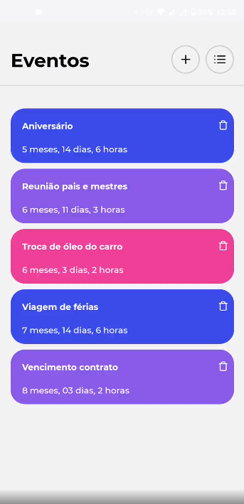
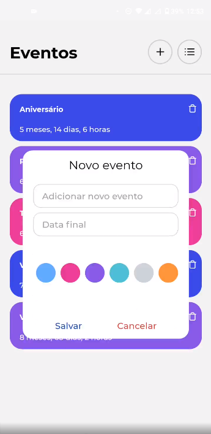
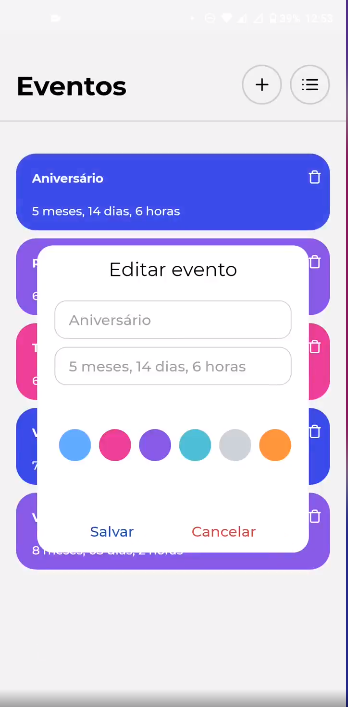

# Countdown event app

Hello, this project was created using React Native with Typescript and Styled Components as well. Feel free to use this repo.

<h1>
    
Home screen

    
</h1>

<h1>
    
New event screen

    
</h1>

<h1>
    
Edit event screen

    
</h1>

## :desktop_computer: Available Scripts

In the project directory, you can run:

### `yarn`

This way you can install all the dependencies that are required to run this project.

### `npx react-native start`

This command will initialize the package/server.

### `npx react-native run-android`

This way you will install the app or your device and if it's already installed it will reload the app.

## :fire: Technologies

This project was built using the following techs:

- React Native.
- TypeScript.
- Styled Components.
